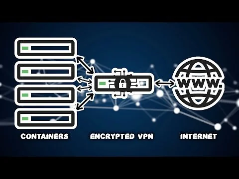

# Welcome

!!! abstract "Executive Overview"
    This Docker image provides a streamlined and efficient way to run the Mullvad VPN service within a containerized environment. By encapsulating the VPN functionality in a dedicated Docker image, users can enhance their privacy and security while using other applications and services in separate containers. This approach not only simplifies the management of VPN connections but also ensures that all network traffic from other containers can be securely routed through the VPN.

    ## Why Use a VPN Container?

    1. **Enhanced Security**: Running a VPN container helps protect sensitive data by encrypting internet traffic, making it more difficult for third parties to intercept or monitor communications.

    2. **Privacy Protection**: By routing traffic through a VPN, users can mask their IP addresses, providing an additional layer of anonymity while browsing the internet or using online services.

    3. **Isolation of Network Traffic**: Using a dedicated VPN container allows for better control over which containers route their traffic through the VPN, enabling users to selectively apply VPN protection to specific applications.

    4. **Simplified Configuration**: The Docker image comes pre-configured with Mullvad VPN, making it easy to set up and use without extensive networking knowledge. Users can quickly deploy the VPN service and connect to it with minimal effort.

!!! attention "Use Cases"
    - **Secure Development Environments**: Developers can use the VPN container to ensure that their development and testing environments are secure, protecting sensitive code and data from potential threats.

    - **Privacy-Conscious Browsing**: Users can run web applications or browsers in separate containers that route their traffic through the VPN, ensuring that their online activities remain private.

    - **Accessing Geo-Restricted Content**: By using a VPN, users can bypass geographical restrictions and access content that may be blocked in their region, such as streaming services or websites.

    - **Multi-Container Applications**: In microservices architectures, where multiple containers communicate with each other, a VPN container can secure the communication between these services, ensuring that data remains protected.
